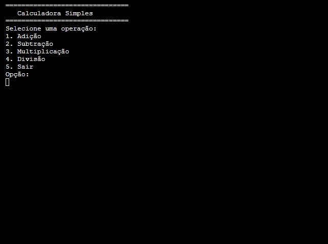

# Calculadora em C
Uma calculadora de terminal feita em C, realizando as operações básicas.


## Demonstração



### Instalação e pré-requisitos

Primeiro, clone o repositório em seu computaodor. Após isto, abra o arquivo 'main.c' em um compilador de C, que aceite C99 ou posterior. Ao compilar o arquivo, um executável será criado, com o nome 'main.exe'. Ao clicar nele, uma tela de terminal rodando o programa será aberta.

## Uso

Ao iniciar o programa, terá uma tela inicial fornecendo as operações disponíveis. As operações matemáticas sempre ocorreram entre 2 números e exibiram o resultado na tela. As operações possíveis são: adição, subtração, multiplicação, divisão.

### Estrutura do projeto

```
Calculadora em C
|── LICENSE
|── main.c
|── README.md
|── Images/
    |── menu_program.png
```


## Licença  
Este projeto está licenciado sob a MIT License - veja o arquivo [LICENSE](LICENSE) para mais detalhes.  